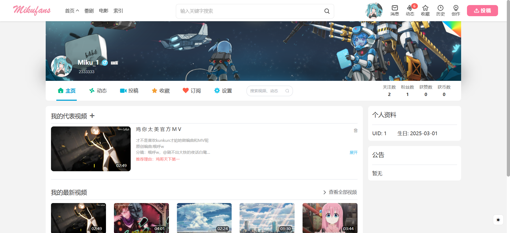

## 简介

### 前言

本项目是我在大学期间耗费将近两年半做的弹幕视频网站，功能和UI主要参考了[B站](https://www.bilibili.com/)，我主要通过这个项目来熟悉掌握前后端各种技术栈。

### 技术栈

#### 前端

Vue3 + Vite  + TypeScript + ElementPlus + Sass + TailwindCSS

#### 后端

Jdk8 + SpringBoot2 + SpringSecurity + MyBatisPlus

#### 数据库

MySQL8 + Redis + ElasticSearch7.17.26

#### 手机端(ReactNative0.74.7)

react-native-video + react-native-reanimated + zustand + jotai

### 声明

本项目仅用于学习与交流，觉得好可以点个star，有BUG或者改进建议都可以提，转发请标明出处。

## 安装说明

### 前置操作

- 配置邮箱的发送人和授权码

`mikufans-system\mikufans-core\src\main\resources\config\application-mail.yml`

- 配置开发环境下的文件保存路径

`mikufans-system\mikufans-core\src\main\resources\config\application-dev.yml`

- 配置生产环境下的文件保存路径(docker启动,默认使用)

`mikufans-system\mikufans-core\src\main\resources\config\application-prod.yml`

- 配置阿里云的OSS对象存储（可选）

`mikufans-system\mikufans-core\src\main\resources\config\application-oss.yml`

- 配置第三方登录（可选）

`mikufans-system\mikufans-core\src\main\resources\config\application-oauth.yml`

```yaml
app:
  oauth:
  	# 这里以github为例
  	# 1.访问 https://github.com/settings/developers
  	# 2.OAuth Apps -> new OAuth App
  	# 3.点击 Generate a new client secret 生成秘钥
    github:
      client_id: 替换成自己的client_id
      client_secret: 替换成自己的client_secret
      redirect_uri: http://改成自己的IP/oauth/redirect/github
```

- 配置前端访问后端的地址

`mikufans-webview/vite.config.ts`

```ts
'/api': {
  target: 'http://改成自己的IP',
  changeOrigin: true,
},
'/socket.io': {
  target: 'http://改成自己的IP',
  changeOrigin: true,
  secure: false,
  ws: true,
}
```

### 使用Docker安装

#### 1.安装Docker

https://www.docker.com/

注意可能需要添加国内镜像

#### 2.安装Git(可选)

https://git-scm.com/

#### 3.执行以下命令

```bash
#添加id为1001的用户,docker容器默认使用该账号
sudo useradd -u 1001 miku
#将新用户添加到docker组
sudo usermod -aG docker miku
#在根目录创建必要目录
sudo mkdir /mikufans /data /repo
#将拥有者改为1001
sudo chown 1001 /mikufans /data /repo
#切换用户到1001(重要)
su miku
#拉取本项目 或 将项目解压后放入根目录即可
git clone https://gitee.com/t_tgl/mikufans.git
#执行启动脚本(注意最好不要使用root启动,可能会出现docker容器无权限问题)
cd /mikufans && ./startup.sh
```

### 传统式安装(不用Docker)

#### 1.部署环境

##### [MySQL8](https://dev.mysql.com/downloads/installer/)

> 执行该SQL文件创建数据库和角色：docker/mysql/init.db
>
> 其它业务表会在项目启动时自动创建，不要手动去执行mikufans-system/sql下的文件

##### [Redis](https://redis.io/downloads/)

> 版本不做要求

[ElasticSearch7.17.26](https://www.elastic.co/)

> 安装完成后，还需要安装中文分词和拼音分词两个插件
>
> elasticsearch-plugin install file:///docker/es/plugins/analysis-ik-7.17.26.zip
>
> elasticsearch-plugin install file:///docker/es/plugins/analysis-pinyin-7.17.26.zip

##### [ffmpeg](https://ffmpeg.org/download.html)

> 版本不做限制，安装后记得加入环境变量。
>
> 检查是否安装成功：ffmpeg -version

#### 2.配置文件

`mikufans-system/mikufans-core/src/main/resources/config/application-dev.yml`

将文件保存路径改为自己电脑的路径

将``docker/backend/background``和``docker/captcha-images``两个文件夹放入``E:/test/mikufans/static`` 或 你在配置文件中``指定的位置``

## 截图

### 用户PC端

#### 首页


#### 番剧页


#### 番剧详情


#### 搜索页


#### 索引页


#### 个人空间



#### 动态页


#### 播放页


#### 创作中心


#### 消息页


#### 分区


#### 播放历史


#### 电影页

准备中

#### 文章页

准备中

### 手机端


### 后台管理

#### 视频审核


